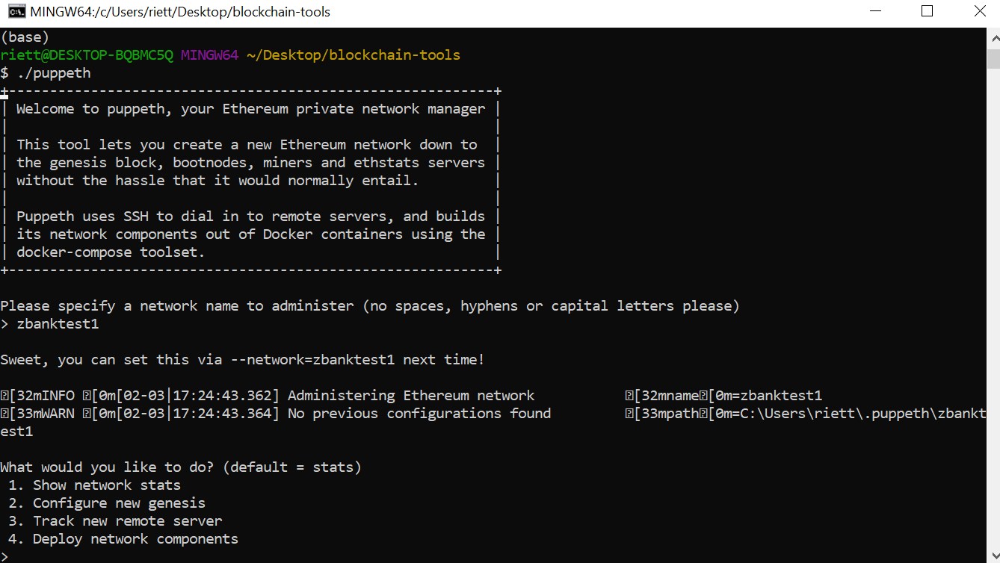
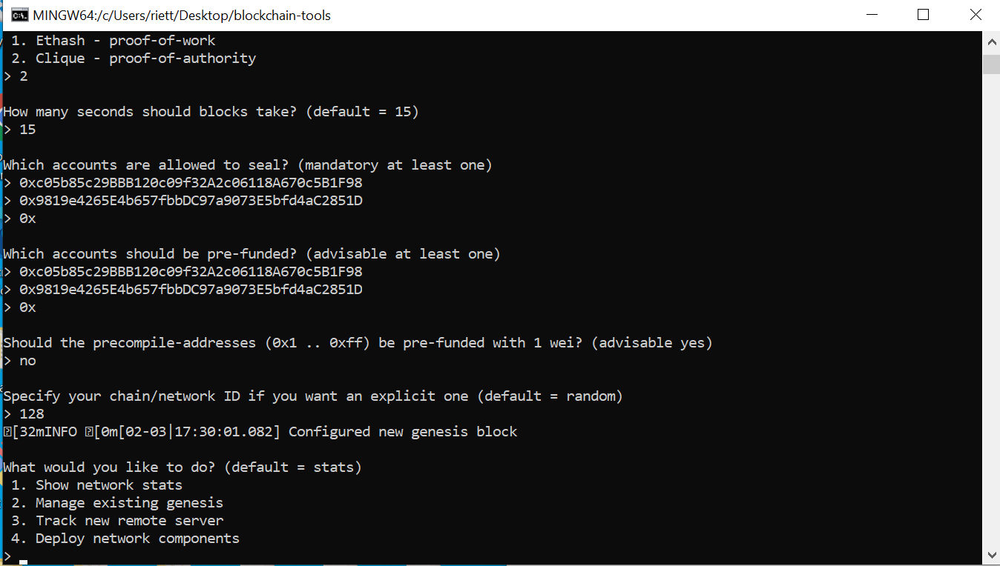
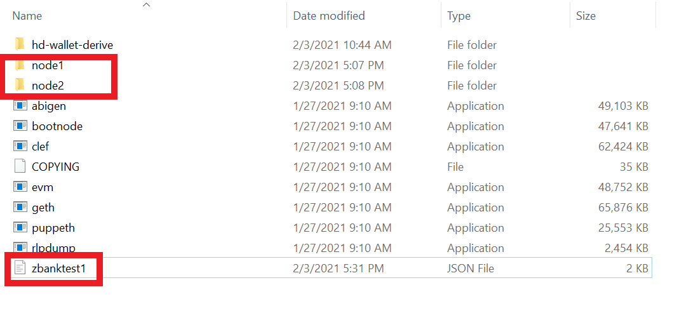
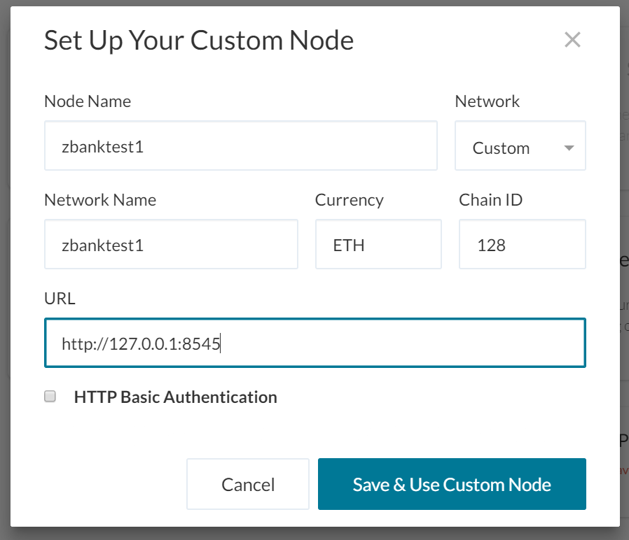
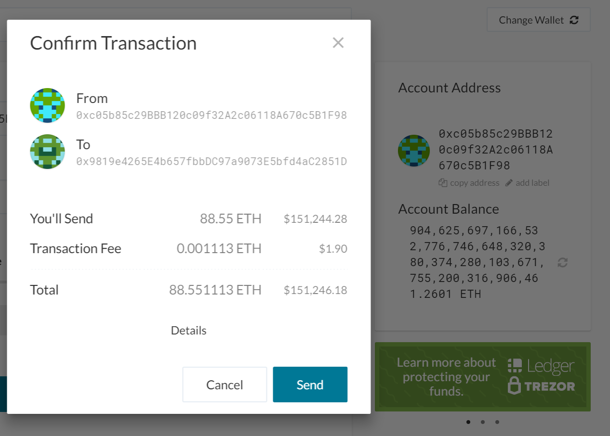
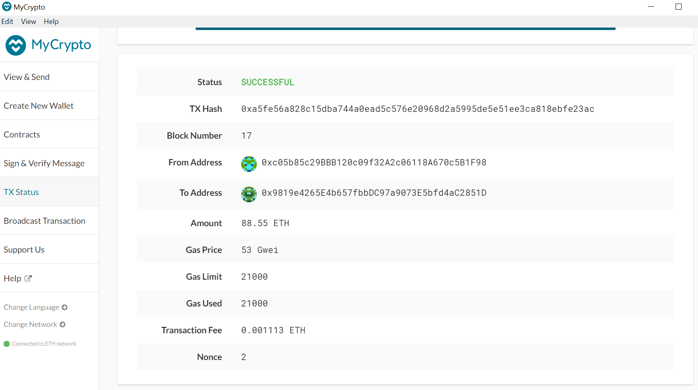

# Unit18_PoA_blockchain
Unit 18 Homework

Create a repository, and instructions for launching the chain
Create a README.md in your project directory and create documentation that explains how to start the network.
Remember to include any environment setup instructions and dependencies.
Be sure to include all of the geth flags required to get both nodes to mine and explain what they mean.
Explain the configuration of the network, such as it's blocktime, chain ID, account passwords, ports, etc.
Explain how to connect MyCrypto to your network and demonstrate (via screenshots and steps) and send a transaction.
Upload the code, including the networkname.json and node folders.


Prerequisites:
-puppeth installed
-MyCrypto installed


Setting up a test network
1. First we have to create two nodes that will be our sealer addresses. Go the folder where your puppeth application is on your computer and create two nodes.

```
    // Create new nodes
    ./geth --datadir node1 account new
    ./geth --datadir node2 account new
```

Remember to take note of the public address that is generated for each node and the password that you choose. These will be our sealer addresses.

2. Then do the following steps in order in gitbash to create a genesis block.

- run puppeth: `./puppeth`
- select a network name to use as your test network. In this example I used "zbanktest1".
- choose Proof of Authority consesus algorithm. This means that only authorized accounts can validate and add blocks to the chain: `2`
- choose 15 as the number of seconds the blocks should take (15 is the default). This is also referred to as blocktime.
- The prompt will ask for the accounts that are allowed to seal. Enter the two public addresses generated from step 1.
- say "no" to the precompiling addresses and pref-funding with 1 wei (cleaner for this testnet)
- specify you chain/network id. Enter any number and take note of it. In this example, I used 128




continue with the following prompts:

- choose "manage existing genesis" : `2`
- choose "export genesis configurations" . This should create a json file with the network name you chose in your folder. you can ignore the other generated files for now. In this example, this created a zbanktest1.json file which can be seen below.

The final folder setup should look like this:



3. Initialize the two nodes:

Open a new gitbash screen and start initializing your two nodes by writing the following code.

```   
    // Initialize
    ./geth --datadir node1 init zbanktest1.json
    ./geth --datadir node2 init zbanktest1.json
```

4. Start Mining! Open two different gitbash screens, one for each node and write the following commands (1 screen each)

```
    // Node 1 start mining
    ./geth --datadir node1 --unlock "node1 sealer address" --mine --nodiscover --rpc --allow-insecure-unlock
```
***Important: Type your password even if you don't see a prompt. After typing it in, you should see an "unlocked" line in the screen. 

In the above lines, we are unlocking our address, and mining for blocks. the rpc flag allows us to connect this node with python. the nodiscover flag prevents the node from getting stuck "looking for peers". Take note of the "enode" section, you will need it for node 2. 

```
    // Node 2 start mining
    ./geth --datadir node2 --unlock "node2 sealer address" --mine --port 30304 --bootnodes "enode of node 1" --ipcdisable --allow-insecure-unlock --nodiscover
```
***Important: Type your password even if you don't see a prompt. After typing it in, you should see an "unlocked" line in the screen.

Similar to node 1, we are unlocking node 2 and mining. We are using a different port (30304) because node 1 is using 30303. Again I put the "nodiscover" flag to prevent my node from getting stuck "looking for peers". Both screens should now be mining for blocks now. 

5. Setup a custom node in MyCrypto
To be able to send test transactions, we first need to connect our testnetwork to MyCrypto. Follow these steps:

- Open you MyCrypto desktop app, look at the bottom left of the screen and select "Change network"
- Click on "Add Custom Node" and add the genesis block information. Below is a sample for my zbanktest1 network. Note that the default URL for our local desktop's RPC is http://127.0.0.1:8545. 



6. Send a Transaction

Now we can send a test transaction in our test network: zbanktest1. Follow the below steps:

- Open your mycrypto desktop app, Go to the upper left hand side and select view and send
- Select "Keystore File"
- Select "Select Wallet File" then go to the the keystore folder inside your node1 folder.
- Put in your password for node1 and press Unlock

Since the two gitbash screens were busy mining ETH, your account balance should show a very big number of ETH by now. 

- In the "To Address", put in your node 2's public address.
- Put in a test amount you would like to send
- Choose a transaction fee. Note that transactions with higher fees will more likely be picked up by miners than those with lower fees.
- Click on Send Transaction and you should see the following confirmation prompt:



Click on Send and you should see green notification at the bottom with your transactions hash. This hash can be used to track your transaction's progress. Once it has been mined, it should turn from pending to successful.




.. And this is how you create your own private blockchain.

7. If you want to restart your nodes. Do not forget to run the following code first:

```
    // Remove nodes
    rm -Rf node1/geth node2/geth
```